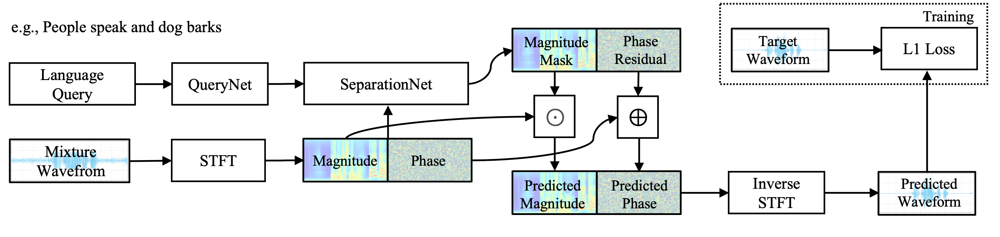

# Audio-Sep-from-Huggin-Face-
## Separate "Anything" You Describe
This work is be take from [Audio Sep](https://github.com/Audio-AGI/AudioSep) and a [demo HF](https://huggingface.co/spaces/Suniilkumaar/AudioSep) of the same model.
# NOTE: This is an anofficial implementation of [Audio Sep](https://github.com/Audio-AGI/AudioSep), but this work without Miniconda :)

<p align="center">
  
</p>

<hr>

## Setup
Go to command prompt, navigate like this:
```shell
cd documents
```
and clone the repository:
```shell
git clone https://github.com/Brodvd/Audio-Sep---from-Huggin-Face---.git
```
Install the dependences in the file `requirements.txt`  (I used Python 3.10, but I think is the same):
```shell
pip install -r requirements.txt 
```

Create the folder `/checkpoint` and download the checkpoints in the folder from [here](https://huggingface.co/spaces/BroDvd/AudioSep/tree/main/checkpoint).

<hr>

## Using
### For the pipiline
* run the file  `pipiline.py`  changing the files path and the text query (I recommend using the folder `/audio` )
  * the file input should be in 32000 KHz, format  `.wav`
  * the file output will be in mono format

NOTE: this model use lot of memory of the computer, so for the old laptop like me (Windows 10 Home) if you give a input file > 1 it will work only with the chunk-based inference that have a few less quality:

```shell
inference(model, audio_file, text, output_file, device, use_chunk=True)
```
### Demo Gradio
* run the file  `app.py`
* copy the link that will be appear in the debug on a browser
* use the model online (like Huggin Face)

Obviously the same of the chunk-based inference if you want to have more speed.

## Training
Go [here](https://github.com/Brodvd/Audio-Sep---from-HF---/blob/main/Training.md) to find the instructions for the training of Audio Sep.

<hr>

## My personal valutation
### Description of the model
AudioSep is a foundation model for open-domain sound separation with natural language queries. AudioSep has two key components: a text encoder and a separation model :

<p align="center">
  
</p>

The model has two checkpoint, one for the text query and the other for the suorce separation, the first in  `.pt` and the second in  `.ckpt` .
### Discussion about the quality of the output of this checkpoint 
If you want to see my valutation of Audio Sep go --> [here](https://github.com/Brodvd/Audio-Sep---from-HF---/blob/main/Valutation.md).

<hr>

## Discussion
If you have any problems/discussions about Audio Sep open a problem in this repository.

## Cite the work done by Audio-Agi

If you found this tool useful, please consider citing
```bibtex
@article{liu2023separate,
  title={Separate Anything You Describe},
  author={Liu, Xubo and Kong, Qiuqiang and Zhao, Yan and Liu, Haohe and Yuan, Yi, and Liu, Yuzhuo, and Xia, Rui and Wang, Yuxuan, and Plumbley, Mark D and Wang, Wenwu},
  journal={arXiv preprint arXiv:2308.05037},
  year={2023}
}
```
```bibtex
@inproceedings{liu22w_interspeech,
  title={Separate What You Describe: Language-Queried Audio Source Separation},
  author={Liu, Xubo and Liu, Haohe and Kong, Qiuqiang and Mei, Xinhao and Zhao, Jinzheng and Huang, Qiushi, and Plumbley, Mark D and Wang, Wenwu},
  year=2022,
  booktitle={Proc. Interspeech},
  pages={1801--1805},
}
```


